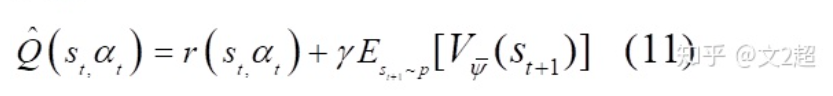
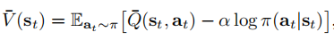
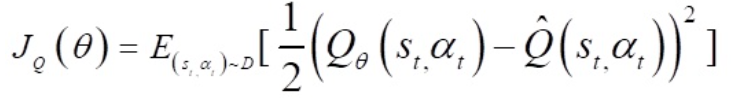
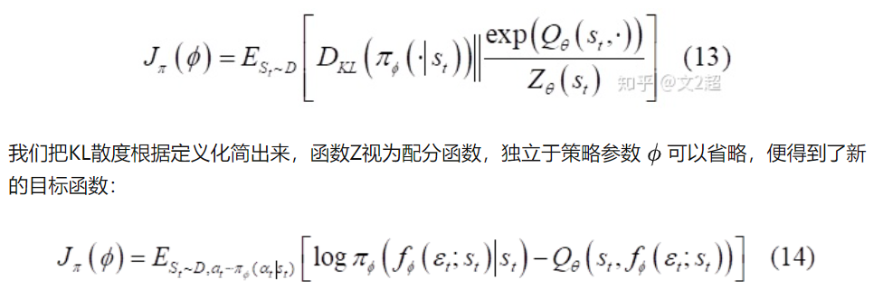

# ```encoder.py```:

一个经典的卷积神经网络，提供2，4，6层的不同配置:

obs_shape: 输入图片的维度，保证是c\*h\*w

feature_dim: 输出的维度，一般设为50

 num_layers:卷积层的层数 

num_filters: 即卷积神经网络中的out_channels
        
前向传播的输入形状为torch.Size([1, 9, 84, 84]),输出的形状为torch.Size([1, 50])


提供 copy_conv_weights_from方法，将此网络的参数与另个网络绑定在一起，同时更新

# ```decoder.py```
与encoder几乎一样，只是将卷积的过程换成了反卷积的过程，并且不提供copy_conv_weights_from 方法

前向传播输入形状为torch.Size([128, 50])，输出形状为torch.Size([128, 9, 84, 84])


# ```sac_ae.py```

```def gaussian_logprob(noise, log_std)```:计算对数似然概率，其中noise = torch.randn_like(mu)，mu和log_std都是网络输出的结果，其大小为torch.Size([bz, 6])

```def squash(mu, pi, log_pi)```在原始熵计算公式后添加一项修正系数，得到最终的mu，pi，log_pi

## ```Actor```类

1. 利用之前构建的encoder构造self.encoder
2. 规定了log_std的上界和下界，用self.log_std_min和self.log_std_max 表示
3. 自身内部的神经网络叫self.trunk,最终从encoder的feature_dim维度到2*action_shape维度
4. 在前向传播过程中，首先让输入图片obs经过卷积神经网络得到feature_dim维的向量，再通过自身的线性层，将结果分片，得到mu和log_std：```mu, log_std = self.trunk(obs).chunk(2, dim=-1)```，接着将log_std缩放到上下界之间，如果compute_pi，compute_log_pi变量为真时还将计算pi，log_pi

## ```Critic```类

1. 利用之前构建的encoder构造self.encoder
2. 调用QFunction类，它里面有一个全连接层，其作用是给定一个obs（经过编码后的）和一个action而计算q(s,a)
3. 采用了double Q-learning 方法，前向传播时从一张完整的图片obs产生q1和q2
   
## ```SacAeAgent```类
这个类非常牛掰，得细讲

抛开参数设置，首先它定义了一个actor和一个critic，然后初始化时将critic的参数赋值给目标网络self.critic_target:

```self.critic_target.load_state_dict(self.critic.state_dict())```

**然后重要的一点就是你的RAE只能有一个吧，所以你得让你actor的RAE参数和critic的RAE参数相同，但是和critic_target的参数不同:**

```self.actor.encoder.copy_conv_weights_from(self.critic.encoder)```

这里的熵项的alpha也是学出来的，有self.log_alpha变量，初始化为init_temperature

接着将target_entropy初始化为-|A|：

```self.target_entropy = -np.prod(action_shape)```

decoder比较平淡，用self.decoder来表示

我们一共有四个东西需要学习：decoder，actor，critic，log_alpha,所以这里定义了四个优化器

接着我们来看一下这些参数是如何更新的：

### ```update_critic(self, obs, action, reward, next_obs, not_done, L, step)```:

我们给定一组已知数据，即（S,A,R,S'),首先我们得用如下公示求出target_Q:


在代码中是这么干的：
```target_Q = reward + (not_done * self.discount * target_V)```
怎么求target_V呢？我们得用到以下公式：

在代码中Q_bar是用两个Q网路的最小值得到的，所以整体的Q值估计会长成这样：

``` python
_, policy_action, log_pi, _ = self.actor(next_obs)
target_Q1, target_Q2 = self.critic_target(next_obs, policy_action)
# 这里采用了double Q-learning防止其中一个Q网络的估值过高
# 计算有熵的形式的V和Q
target_V = torch.min(target_Q1,
                        target_Q2) - self.alpha.detach() * log_pi
target_Q = reward + (not_done * self.discount * target_V)
```
接下来做的事情就是用self.critic得到现在的Q值，并且用下式加以更新：



代码看上去是这样：
```
current_Q1, current_Q2 = self.critic(obs, action)
    # J(Q)
critic_loss = F.mse_loss(current_Q1,target_Q) + F.mse_loss(current_Q2, target_Q)
```

### ```update_actor_and_alpha(self, obs, L, step)```
这个函数中我们要更新的是actor和alpha，首先我们对actor的策略进行评估计算其损失函数，公式是下面这段：



然后人家这里嗨计算了alpha的loss，我看不懂，但是他确实是得到了更新

### ```def update_decoder(self, obs, target_obs, L, step):```

加了正则化项的mseloss不赘述

所以整体的一轮更新的逻辑会是这样：
``` python
def update(self, replay_buffer, L, step):
    # 采样
    obs, action, reward, next_obs, not_done = replay_buffer.sample()

    L.log('train/batch_reward', reward.mean(), step)

    self.update_critic(obs, action, reward, next_obs, not_done, L, step)

    if step % self.actor_update_freq == 0:
        self.update_actor_and_alpha(obs, L, step)

    if step % self.critic_target_update_freq == 0:
        # 软更新
        utils.soft_update_params(
            self.critic.Q1, self.critic_target.Q1, self.critic_tau
        )
        utils.soft_update_params(
            self.critic.Q2, self.critic_target.Q2, self.critic_tau
        )
        utils.soft_update_params(
            self.critic.encoder, self.critic_target.encoder,
            self.encoder_tau
        )

    if self.decoder is not None and step % self.decoder_update_freq == 0:
        self.update_decoder(obs, obs, L, step)
```
1. 从buffer中采样
2. 利用采集到的样本更新critic
3. 达到一定步数后，更新actor和alpha
4. 达到一定步数后，软更新目标网络，这里的目标网络包含target中的encoder以及计算Q值的全连接层
5. 达到一定步数后更新decoder

那么，原论文中的细节有没有体现呢？有的！原论文中说
>We also prevent the actor’s gradients from updating the
convolutional encoder.

在更新actor时，将detach_encoder设置为True，此时encoder中会执行
``` python
        if detach:
            h = h.detach()
```

## ```train.py```
其中的evaluate()函数让智能体跑一轮并且录像

在具体的训练流程中的逻辑是这样的：
在最大的训练步数之内：
* 如果游戏玩完了：
  * 记录当前步数
  * 达到评估步数要求之后，评估当前模型，保存模型
  * 重置环境，把episode_reward 和 episode_step置零，并且让episode+1
* 如果没有玩完：
  * 在开始阶段随机采样一些action，后面用actor来决定其action
  * 进行一定轮数的更新
  * 将获得的action（无论是随机的还是actor自己决定的）与环境交互，得到相关状态转移和奖励
  * 若游戏玩完或者步数达到上限，则将done_bool设置为true
  * 更新累计奖励，并将这一条采样加入到buffer中
  * 继续玩游戏